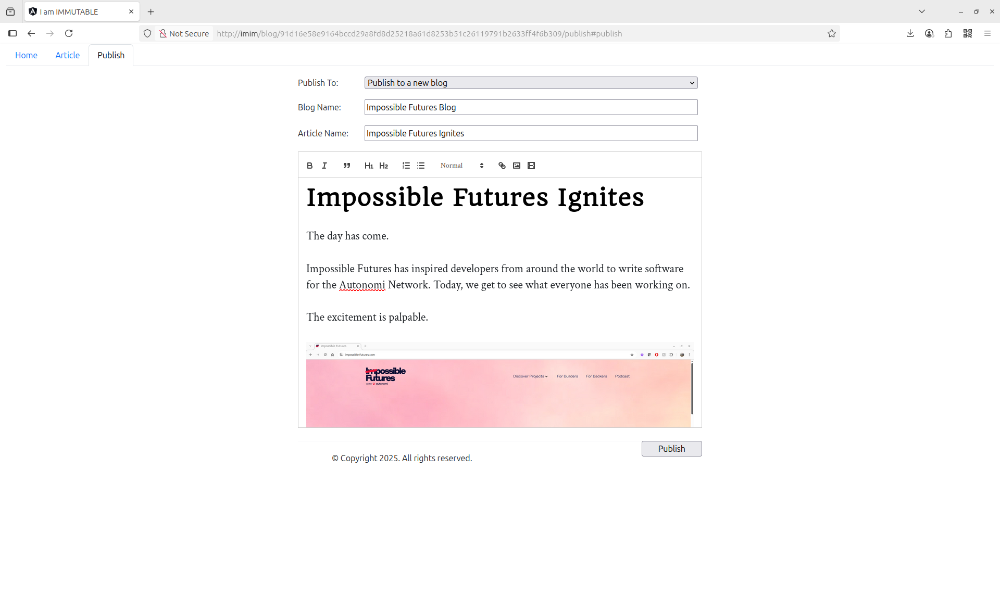
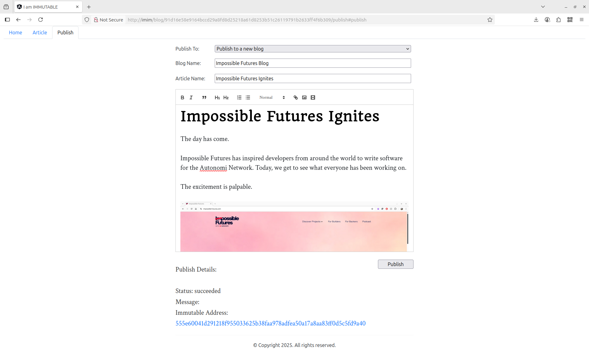

# I Am IMMUTABLE client

## Background

_I Am Immutable_, or IMIM, is a blog application which is native to Autonomi. It allows a blog's articles to be
persisted to the network and be accessible _in perpetuity_.

You will not be mutable. Neither will your data.

IMIM blogs are dependent on AntTP and can be viewed using a regular web browser. You can choose to use either a local instance of
AntTP for maximum performance and privacy, or you can use a hosted gateway (such as https://anttp.antsnest.site/gimim).

AntTP is an HTTP proxy, which provides an interface between your web browser and the Autonomi Network. You can find out more about
AntTP here: https://github.com/traktion/AntTP

## Accessing Content

The simplest way to view content is through a hosted AntTP gateway. My blog can be viewed here, for example: https://anttp.antsnest.site/gimim/blog/traktion-blog

A better way is to run AntTP locally, where you get performance and privacy benefits. My blog can then be viewed
either via a local gateway (http://localhost:18888/gimim/blog/traktion-blog) or you can configure your alternative browser to use
view it via an AntTP proxy (http://imim/blog/traktion-blog).

## Adding Content

### Using the UI

Using the UI is the simplest way to upload a blog. No CLI, no fiddling about with text editors. You just dump your thoughts into a WYSIWYG editor, then click a button.

In the spirit of dog fooding, there is an article about it on my blog too: https://anttp.antsnest.site/gimim/blog/traktion-blog/article/say-goodbye-to-the-cli.md#article

> IMPORTANT: At the time of writing, you must be running the AntTP as a local proxy to use the UI! You must also set your 'wallet-private-key' and 'app-private-key' as AntTP parameters.
> 
> In a future version of IMIM, you will be able to use gateways, even public gateways, to upload articles. AntTP will soon support remote upload payments.

#### Creating a New Blog

In short, you go to the 'publish' tab and complete the form:

1. Go to http://imim/blog/91d16e58e9164bccd29a8fd8d25218a61d8253b51c26119791b2633ff4f6b309/publish#publish 
2. Set 'Publish To:' to 'Publish to a new blog'
3. Set 'Blog Name:' to whatever you want to call the blog (REMEMBER THIS - it allows you to add more articles!)
4. Set 'Article Name:' to your article name
5. Start writing content in the editor. Add some pictures too, then click 'Publish'
6. Status information should start showing, then shortly after, you will be given an XOR address (and link) to view your new blog article. 

You can see the above blog here:

- Through local AntTP proxy: http://imim/blog/555e60041d291218f955033625b38faa978adfea50a17a8aa83ff0d5c5fd9a40
- Through Ant's Nest gateway: https://anttp.antsnest.site/gimim/blog/555e60041d291218f955033625b38faa978adfea50a17a8aa83ff0d5c5fd9a40

> NOTE: Only an immutable XOR address is created by the UI at this time. See creating a pointer below to provide a dynamic address.
> 
> AntTP supports creating pointers through a REST interface and this functionality will be integrated soon!

#### Adding Another Article

You can also add articles through the UI. Browse to one of your existing blog articles, then click the 'publish' tab and follow the instructions:

1. Using the above example, go to http://imim/blog/555e60041d291218f955033625b38faa978adfea50a17a8aa83ff0d5c5fd9a40/publish#publish
2. Set 'Publish To:' to 'Publish to this blog <XOR>'
3. Set 'Blog Name:' to the _same name_ as before
4. Set 'Article Name:' to your new article's name
5. Add your text and images to the editor, then click publish.
6. Wait for the status update and your new XOR link.

You can see the above blog here:

- Through local AntTP proxy: http://imim/blog/8af990d7fbb235f8d2d3656f7202840edfc764bac1adf7ee1bcb248241343d91
- Through Ant's Nest gateway: https://anttp.antsnest.site/gimim/blog/8af990d7fbb235f8d2d3656f7202840edfc764bac1adf7ee1bcb248241343d91

Let's add a pointer this time with a (little!) CLI magic:

```bash
ant pointer create impossible_futures 8af990d7fbb235f8d2d3656f7202840edfc764bac1adf7ee1bcb248241343d91
```

This returned a pointer of `b63e664aa6786eea741d8d931ddbf4361c4406af51bf894c89989e2e3957180a0ca9c15e2cc5786db5c5a34bda1786a2` from my key. So, now
we can see the blog at:

- Through local AntTP proxy: http://imim/blog/b63e664aa6786eea741d8d931ddbf4361c4406af51bf894c89989e2e3957180a0ca9c15e2cc5786db5c5a34bda1786a2
- Through Ant's Nest gateway: https://anttp.antsnest.site/gimim/blog/b63e664aa6786eea741d8d931ddbf4361c4406af51bf894c89989e2e3957180a0ca9c15e2cc5786db5c5a34bda1786a2

What happens when we edit the pointer through the proxy? Good question! It will upload the archive, but not update the pointer (a bug it seems). Expect
this functionality to come to IMIM soon!

### Using ant CLI

Using the CLI can give you more control over your content. You can use your own editor, curate your image links, add automation, or add your own flair.

Remember, the data always remains your own, no matter which way you upload it.

#### Creating a New Blog

Articles should be created using Markdown (like this README.md file). These are easy to write
with a simple syntax and editors are available too. The application will convert these Markdown
files to HTML on the fly.

There are many Markdown editors out there, but they are easy to write in a simple text editor too. Take a look at https://www.markdownguide.org/ for
more information about Markdown. They also have a cheat sheet to get you started: https://www.markdownguide.org/cheat-sheet/

Any images or videos should be in the regular Markdown format and should be saved to the same folder as the article markdown files, e.g. ``
for images or `` for videos.

Once the articles have been written, they can be uploaded to Autonomi as a 'public archive' using the `ant` CLI.

A 'public archive' is a collection of files, which is similar to a folder on your computer. All the files can then be referenced
using an Autonomi address, which is sometimes known as an XOR address.

Use `ant file upload -p <your_blog_folder>` to upload your blog articles, images, videos, etc, as a public archive:

```bash
ant file upload -p "amazing_blog"
```

This will return a list of chunks which are created in the upload process. It will also return an XOR address for the public archive - this
is the one we are interested in: This is the immutable XOR address of the blog you just uploaded. It will exist forever.

At the time of writing, `ant` returns something like this:

```bash
At address: 91d16e58e9164bccd29a8fd8d25218a61d8253b51c26119791b2633ff4f6b309
```

The `91d16e58e9164bccd29a8fd8d25218a61d8253b51c26119791b2633ff4f6b309` is your blog's XOR address. Or, in this case, it is the address of the
example Maidsafe blog. You can see it here: https://anttp.antsnest.site/gimim/blog/91d16e58e9164bccd29a8fd8d25218a61d8253b51c26119791b2633ff4f6b309

#### Creating a Pointer

As any good blog will have lots of content, creating a pointer to your content is desirable. A pointer can also be used as a dynamic network
address with AntTP and it will point to whichever XOR address your blog has been given (by `ant file upload`).

Let's use Maidsafe's example blog to see how this can work.

We can use the `ant` CLI again, but this time `ant pointer create`:

```bash
ant pointer create -t maidsafe 91d16e58e9164bccd29a8fd8d25218a61d8253b51c26119791b2633ff4f6b309
```

NOTE: If you don't have a pointer key, follow the CLI instructions to create one.

This will return something including the following:

```bash
Pointer created at address: a327aa11f4cac684bf23013542789a4776a93e9b0e50bf8a06dfc8db1dc2760961105adfa37e598f03669d5c5fabe986
```

You can now use this pointer in your URLs to share your blog, e.g. https://anttp.antsnest.site/gimim/blog/a327aa11f4cac684bf23013542789a4776a93e9b0e50bf8a06dfc8db1dc2760961105adfa37e598f03669d5c5fabe986

#### Updating an Existing Blog

Updating an existing blog is much like creating a new one. Just update the files in your blog directory and upload it as a 'public archive'.

Only the files (chunks) that don't already exist on the network will be uploaded, so you will only need to pay for these new chunks, e.g.

```bash
ant file upload -p "amazing_blog"
```

Don't forget to update the pointer to point at the new location returned, so that your readers can see your latest content:

```bash
ant pointer edit maidsafe a33082163be512fb471a1cca385332b32c19917deec3989a97e100d827f97baf
```

Refresh your browser a couple of times, then you will now see the latest version of the blog at the same address, e.g. https://anttp.antsnest.site/gimim/blog/a327aa11f4cac684bf23013542789a4776a93e9b0e50bf8a06dfc8db1dc2760961105adfa37e598f03669d5c5fabe986

## Tarchives

Tarchives are a newly supported feature in AntTP. In short, they are a tar file, with an index appended to the end.

From outside of AntTP, a 'tarchive' look the same as a 'public archive'. In short, it is another container of files, which is addressible via an
XOR address.

Tarchives allow lots of small files to be packed into a single file. This reduces the number of chunks to both upload and download. AntTP is smart
enough to only download the chunks needed (from the tar file), which are then cached to allow other files within those chunks to be accessed quickly.

Tarchives, especially with lots of small files, tend to be served much faster. For the IMIM loading traktion-blog, it is about 3x quicker from a
en empty cache.

You can see more information about tarchives at the AntTP project: https://github.com/traktion/AntTP?tab=readme-ov-file#tarchive-support

> IMPORTANT: You can't currently use the UI to add/edit IMIM blogs at this time - the CLI must be used. AntTP will add support for creating/updating
> tarchives in the near future, which IMIM will then (without changes) take advantage of.

## Bookmarks

How do I get those funky short names? It is a feature of AntTP, where you can give a friendly name to an XOR and pointer address. They are hard
coded into AntTP at this time, although more can be added through the AntTP CLI. It is expected that these will be lookups to an Autonomi
DNS style system in the near future.

If you want a name added in the interim, you are welcome to create a PR to AntTP with your name and address. They will be first come, first serve
and I reserve the right to wipe and/all at any time. It is an experimental AntTP feature after all!

## Writing Tips

Use the following format for the header title, which will allow it to be linked to the article URL when it renders:

```
# Article Title
```

Assume that assets (images, videos, audio, etc) are in the same folder as the articles and just reference the file names with no paths, e.g.

``

## Viewing Blog

The blog URLs are used to derive the location of the blog and article data. The format is:

```bash
/blog/<blog autonomi-address|XOR address|pointer address>/article/<article autonomi-address|XOR address|pointer address>
```

## Development server

IMIM is open source, so if you want fork it, add features to it or contribute to the project, you are very welcome to!

The easiest way to develop locally is to use a browser in with AntTP as a proxy, then use `ng serve` to host the local code. This will allow
you to retrieve data from Autonomi, while running the latest web app code.

You can also configure AntTP to use the Autonomi alpha network to avoid upload fees. See AntTP for details on how to configure bootstrapping.

Run `ng serve --serve-path /gimim/` for a dev server. Navigate to `http://localhost:4200/gimim/`. The app will automatically reload if you change any of the source files.

## Code scaffolding

Run `ng generate component component-name` to generate a new component. You can also use `ng generate directive|pipe|service|class|guard|interface|enum|module`.

## Build

Run `ng build` to build the project. The build artifacts will be stored in the `dist/` directory. Use the `--prod` flag for a production build.

For creating a gateway IMIM build:

`ng build --configuration production --base-href /gimim/ --deploy-url /gimim/`

For creating a proxy IMIM build:

(only have baseHref in angular.json / build)

`ng build --configuration production`

Then copy `/src/app-conf.json` to `dist/i-am-immutable-client/app-conf.json`, before uploading.

> NOTE: Deploying for both gateways and proxies requires the document root to change. This may require changing the angular.json to correctly deploy
> to the correct path.

To improve performance, IMIM is best distributed as a tarchive (tarindexed tar file). This reduces the chunk count for both uploads and downloads.

To build tarchive:

`cd i-am-immutable-client/; tar -cf ../archive.tar ./; cd ..; python3 ~/dev/tarindexer/tarindexer.py -i archive.tar archive.tar.idx; tar -rf archive.tar archive.tar.idx;`

Then upload to Autonomi:

`ant file upload -p archive.tar`

Then update pointer for `imim` (proxy) or `gimim` (gateway) to use the latest content address of archive.tar, if appropriate (requires my key).

## Code2Tutorial Codebase Documentation

Take a look at this AI generated summary of how IMIM is designed: https://code2tutorial.com/tutorial/a82eb338-a5b6-4765-8b55-6e22cf31ae6f/index.md
